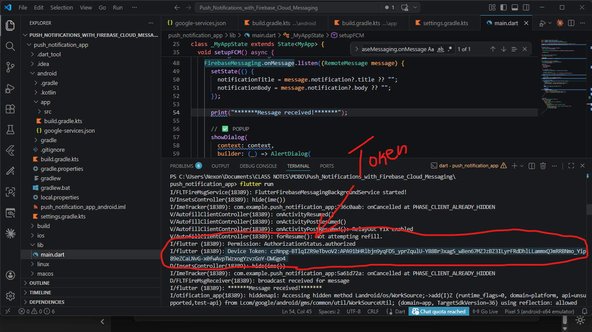
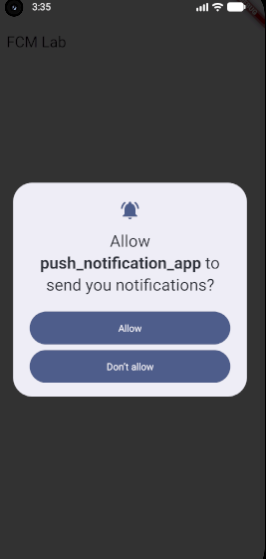
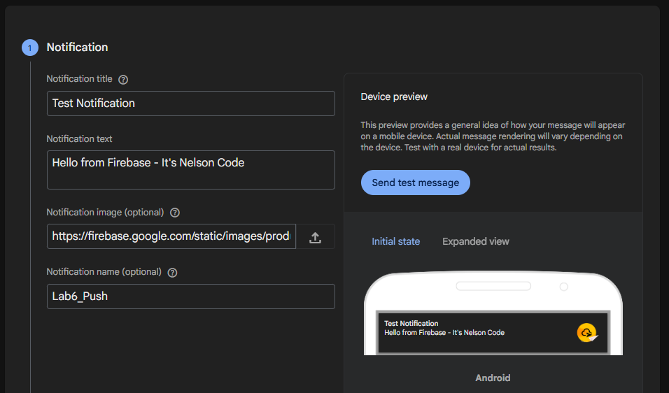
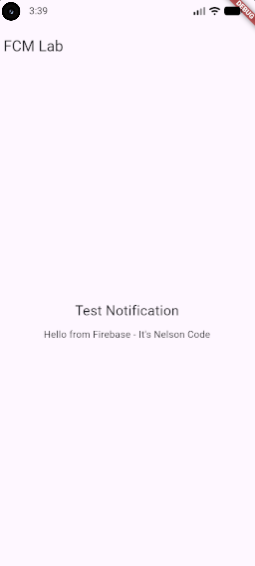
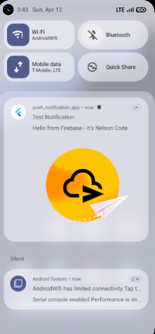

# 📱 Push Notifications with Firebase Cloud Messaging (FCM)

## 👨‍🎓 Student Information

* **Name:** Nelson RUTWAZA
* **Reg No:** 223026976
* **Course:** Mobile Application Development
* **Year:** 3rd Year CSE
* **Institution:** University fo Rwanda
* **Lab:** Lab 6 – Push Notifications with Firebase Cloud Messaging

---

## 🎯 Objective

The objective of this lab is to create a Flutter mobile application that can receive push notifications using Firebase Cloud Messaging (FCM).

---

## 🛠️ Tools & Technologies

* Flutter
* Firebase Cloud Messaging (FCM)
* Android Studio / VS Code

---

## ⚙️ Implementation Steps

### 1. Created Flutter Application

A new Flutter project was created using the Flutter CLI.

### 2. Integrated Firebase

* Created a Firebase project
* Connected Android app
* Added `google-services.json`

### 3. Configured FCM

* Added required dependencies
* Configured Gradle files
* Enabled notification permissions

### 4. Retrieved Device Token

The device token was generated and printed in the console.

### 5. Run the App and Enabled Permissions

The application requested notification permissions from the user.

### 6. Sent Notification from Firebase

A test notification was created and sent using Firebase Console.

### 7. Received Notification on Device while app is In the background

The notification was successfully received on the mobile device.

---

## ✅ Expected Results Achieved

* Successfully sent notification from Firebase
* Received notification on device
* Displayed notification in app UI
* Popup dialog shown on message receive

---

## 📌 Conclusion

The lab was successfully completed by integrating Firebase Cloud Messaging with a Flutter application. The app can now receive and display push notifications in both foreground and background states.

---

## 🔗 GitHub Repository

https://github.com/Rutwaza/Lab-6-Push-Notifications-FCM.git
